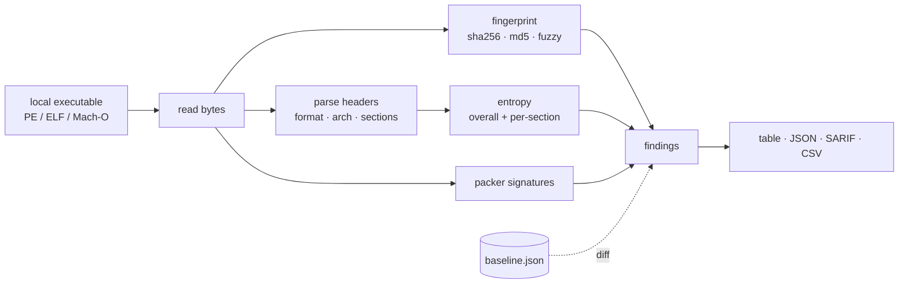

<a name="top"></a>
<div align="center">


# BINHUNT

### Game/desktop binary integrity scanner that fingerprints executables, detects common packers/obfuscators, and diffs against a known-good baseline to catch tampering.


[](https://pypi.org/project/cognis-binhunt/) [](https://github.com/cognis-digital/binhunt/actions) [](LICENSE) [](https://github.com/cognis-digital)

*Application & Mobile Security — SAST/DAST-lite and binary triage.*

</div>

```bash
pip install cognis-binhunt
binhunt scan ./client.exe        # → fingerprint + packer/entropy findings in milliseconds
```

`binhunt` is **passive and fully offline** — it reads a file off disk, parses
the executable headers itself (no `objdump`, no `file`, no network), and prints a
verdict. There is **no active/remote scanning** anywhere in the tool.

## Usage — step by step

`binhunt` fingerprints a binary (format / arch / sha256+md5 / overall + per-section Shannon entropy / section layout), flags packers and obfuscators, and diffs against a known-good baseline to detect tampering or trojanized clients.

1. **Install** (Python 3.10+, standard library only):
   ```bash
   pip install cognis-binhunt
   # or from source:
   git clone https://github.com/cognis-digital/binhunt && cd binhunt && pip install -e .
   ```
2. **Scan a binary** for packers, entropy, and section layout:
   ```bash
   binhunt scan ./client.exe
   ```
3. **Record a known-good baseline, then verify a downloaded copy**:
   ```bash
   binhunt baseline ./good/client.exe -o baseline.json
   binhunt diff ./downloaded/client.exe --baseline baseline.json
   ```
4. **Read the output** as JSON (e.g. the worst severity, for gating):
   ```bash
   binhunt --format json scan ./client.exe | jq .max_severity
   ```
5. **Emit SARIF** straight into GitHub code-scanning, or **CSV** for a spreadsheet:
   ```bash
   binhunt --format sarif scan ./client.exe > binhunt.sarif
   binhunt --format csv   scan ./client.exe > findings.csv
   ```
6. **Gate CI on tampering** — exit `2` when the worst finding meets/exceeds the
   threshold, `0` when clean, `1` on error. Tune the gate with `--fail-on`:
   ```yaml
   - run: |
       pip install cognis-binhunt
       binhunt --fail-on high diff ./client.exe --baseline baseline.json
   ```


## Contents

- [Why binhunt?](#why) · [Features](#features) · [Quick start](#quick-start) · [Example](#example) · [Architecture](#architecture) · [AI stack](#ai-stack) · [How it compares](#how-it-compares) · [Integrations](#integrations) · [Install anywhere](#install-anywhere) · [Related](#related) · [Contributing](#contributing)

<a name="why"></a>
## Why binhunt?

Pairs DIE-style packer detection with a baseline-diff workflow so studios can detect modded/trojanized game clients in distribution — a virality hook for the modding/cheat-detection crowd.

`binhunt` is single-purpose, scriptable, and self-hostable: point it at a target, get prioritized results in the format your workflow already speaks (table · JSON · SARIF), gate CI on it, and let agents drive it over MCP.

<div align="right"><a href="#top">↑ back to top</a></div>

<a name="features"></a>
## Features

- ✅ **Format + arch detection** — PE, ELF, Mach-O (incl. FAT), x86/x86-64/arm/arm64/riscv, parsed by binhunt's own header readers (no external tools)
- ✅ **Cryptographic fingerprint** — sha256 + md5 of the whole file
- ✅ **Fuzzy fingerprint** — alignment-tolerant block hashes that *localize where* two binaries differ, plus a `fuzzy_similarity()` score (0..1)
- ✅ **Shannon entropy** — overall and **per-section** (bits/byte); high entropy ⇒ likely packed/encrypted
- ✅ **Section parsing** — name, file offset, size, and entropy for every section/segment
- ✅ **Packer / obfuscator detection** — section-name markers **and** raw signatures for UPX, ASPack, Petite, MPRESS, Themida, VMProtect, Enigma, NsPack, PELock, PECompact, yoda
- ✅ **Baseline build + diff** — record a known-good JSON, then detect hash mismatch, size change, per-section entropy drift, and added/removed sections (catches trojanized / modded clients)
- ✅ **Output formats** — `table` · `json` · **SARIF 2.1.0** (GitHub code-scanning) · **CSV**
- ✅ **CI exit-code gate** — `--fail-on {info,low,medium,high,critical}` (default `medium`)
- ✅ **MCP server** — `binhunt mcp` exposes `scan`/`baseline`/`diff` as tools
- ✅ **Passive & offline** — reads one local file, never opens a socket
- ✅ Runs on Linux/macOS/Windows · Docker · devcontainer
- ✅ Ports in Python, JavaScript, Go, and Rust (`ports/`), byte-for-byte consistent on the demo fixture

<div align="right"><a href="#top">↑ back to top</a></div>

<a name="quick-start"></a>
## Quick start

```bash
pip install cognis-binhunt
binhunt --version
binhunt scan ./client.exe                       # human-readable table
binhunt --format json  scan ./client.exe        # machine-readable
binhunt --format sarif scan ./client.exe        # GitHub code-scanning
binhunt --fail-on high scan ./client.exe        # CI gate (exit 2 on high+)
```

<div align="right"><a href="#top">↑ back to top</a></div>

<a name="example"></a>
## Example — real output

Scanning the committed demo binary (`demos/01-basic/sample.elf`, a minimal ELF
with a deliberately high-entropy `.packed` section):

```text
$ binhunt scan demos/01-basic/sample.elf
file      : demos/01-basic/sample.elf
format    : ELF  (x86-64)
size      : 4505 bytes
sha256    : c6d6ba0a71955b3df685d8362d910e008e2cef7d618ecf5849eab3db3e6c9fa6
md5       : 81640e4eb8a915700d37ab146e22d779
entropy   : 7.7834 bits/byte
sections  :
    name                offset        size   entropy
    <unnamed>                0           0       0.0
    .text                   64          64       0.0
    .packed                128        4096       8.0
    .shstrtab             4224          25    3.5737
findings  :
    [MEDIUM  ] HIGH_ENTROPY: High overall entropy
             Entropy 7.7834 bits/byte suggests packing/encryption.
    [MEDIUM  ] SECTION_ENTROPY: High-entropy section: .packed
             entropy=8.0 size=4096; possible packed payload.
verdict   : MEDIUM
$ echo $?
2
```

### Worked example — catch a tampered client

```text
$ binhunt baseline ./good/client.exe -o baseline.json
wrote baseline with 1 entry to baseline.json

$ binhunt diff ./downloaded/client.exe --baseline baseline.json
file   : ./downloaded/client.exe
sha256 : 9f2c...e1
[CRITICAL] HASH_MISMATCH: Binary differs from baseline
         sha256 mismatch (baseline=3a7b9c01d2e4f5a6..., got=9f2c10ab33de77c1...). Fuzzy similarity=94%.
[HIGH    ] SECTION_DRIFT: Section '.text' entropy changed
         baseline=6.12 now=7.71 (delta=+1.590); possible code patch or injected payload.
```

The `94%` fuzzy similarity plus a single drifting section pinpoints a small,
localized patch to `.text` rather than a wholesale replacement.

<div align="right"><a href="#top">↑ back to top</a></div>

<a name="architecture"></a>
## Architecture



All boxes run in-process on local bytes — no subprocess, no socket.

<div align="right"><a href="#top">↑ back to top</a></div>

<a name="ai-stack"></a>
## Use it from any AI stack

`binhunt` is interoperable with every popular way of using AI:

- **MCP server** — `binhunt mcp` (Claude Desktop, Cursor, Cognis.Studio, [uncensored-fleet](https://github.com/cognis-digital/uncensored-fleet))
- **OpenAI-compatible / JSON** — pipe `binhunt scan . --format json` into any agent or LLM
- **LangChain · CrewAI · AutoGen · LlamaIndex** — wrap the CLI/JSON as a tool in one line
- **CI / scripts** — exit codes + SARIF for non-AI pipelines

<div align="right"><a href="#top">↑ back to top</a></div>

<a name="how-it-compares"></a>
## How it compares

| | **Cognis binhunt** | DIE (Detect It Easy) + capa, packaged for CI baselining |
|---|:---:|:---:|
| Self-hostable, no account | ✅ | varies |
| Single command, zero config | ✅ | ⚠️ |
| JSON + SARIF for CI | ✅ | varies |
| MCP-native (AI agents) | ✅ | ❌ |
| Polyglot ports (JS/Go/Rust) | ✅ | ❌ |
| Open license | ✅ COCL | varies |

*Built in the spirit of **DIE (Detect It Easy) + capa, packaged for CI baselining**, re-framed the Cognis way. Missing a credit? Open a PR.*

<div align="right"><a href="#top">↑ back to top</a></div>

<a name="integrations"></a>
## Integrations

Pipes into your stack: **SARIF** for code-scanning, **JSON** for anything, an **MCP server** (`binhunt mcp`) for AI agents, and a webhook forwarder for SIEM/Slack/Jira. See [`docs/INTEGRATIONS.md`](docs/INTEGRATIONS.md).

<div align="right"><a href="#top">↑ back to top</a></div>

<a name="install-anywhere"></a>
## Install — every way, every platform

```bash
pip install "git+https://github.com/cognis-digital/binhunt.git"    # pip (works today)
pipx install "git+https://github.com/cognis-digital/binhunt.git"   # isolated CLI
uv tool install "git+https://github.com/cognis-digital/binhunt.git" # uv
pip install cognis-binhunt                                          # PyPI (when published)
docker run --rm ghcr.io/cognis-digital/binhunt:latest --help        # Docker
brew install cognis-digital/tap/binhunt                             # Homebrew tap
curl -fsSL https://raw.githubusercontent.com/cognis-digital/binhunt/main/install.sh | sh
```

| Linux | macOS | Windows | Docker | Cloud |
|---|---|---|---|---|
| `scripts/setup-linux.sh` | `scripts/setup-macos.sh` | `scripts/setup-windows.ps1` | `docker run ghcr.io/cognis-digital/binhunt` | [DEPLOY.md](docs/DEPLOY.md) (AWS/Azure/GCP/k8s) |

<div align="right"><a href="#top">↑ back to top</a></div>

<a name="related"></a>
## Related Cognis tools

- [`apkpeek`](https://github.com/cognis-digital/apkpeek) — One-command static triage of Android APK/AAB binaries: surfaces hardcoded secrets, exported components, dangerous permissions, and insecure manifest flags as a single SARIF report.
- [`ipasnitch`](https://github.com/cognis-digital/ipasnitch) — Static scanner for iOS .ipa bundles that flags ATS exceptions, missing entitlements hardening, embedded URLs/secrets, and weak Info.plist transport settings.
- [`hookcraft`](https://github.com/cognis-digital/hookcraft) — Generates ready-to-run Frida instrumentation scripts from a YAML intent (e.g. 'bypass SSL pinning', 'dump crypto keys') and verifies they attach to a target process.
- [`dastlite`](https://github.com/cognis-digital/dastlite) — A headless, config-as-code DAST runner that crawls an authenticated web/mobile-API surface and fires a curated active-scan ruleset, emitting deduplicated SARIF.
- [`semsift`](https://github.com/cognis-digital/semsift) — Lightweight semantic-aware SAST that runs curated taint rules over diffs only, so PRs get fast incremental SAST instead of whole-repo scan fatigue.
- [`cheatsense`](https://github.com/cognis-digital/cheatsense) — Anti-cheat telemetry analyzer that ingests game session logs and flags statistically anomalous input/aim/movement signatures with explainable per-flag scoring.

**Explore the suite →** [🗂️ all 170+ tools](https://github.com/cognis-digital/cognis-neural-suite) · [⭐ awesome-cognis](https://github.com/cognis-digital/awesome-cognis) · [🔗 cognis-sources](https://github.com/cognis-digital/cognis-sources) · [🤖 uncensored-fleet](https://github.com/cognis-digital/uncensored-fleet) · [🧠 engram](https://github.com/cognis-digital/engram)

<div align="right"><a href="#top">↑ back to top</a></div>

<a name="contributing"></a>
## Contributing

PRs, new rules, and demo scenarios are welcome under the collaboration-pull model — see [CONTRIBUTING.md](CONTRIBUTING.md) and [SECURITY.md](SECURITY.md).

> ### ⭐ If `binhunt` saved you time, **star it** — it genuinely helps others find it.

## Edge / air-gap

`binhunt` is **stdlib-only and self-contained** — no model downloads, no feed
fetches, no telemetry. The wheel runs unchanged on a disconnected host:

```bash
# on a connected machine
pip download cognis-binhunt -d ./wheels
# copy ./wheels to the air-gapped host, then:
pip install --no-index --find-links ./wheels cognis-binhunt
binhunt --format sarif scan /mnt/usb/suspect.bin > finding.sarif
```

Baselines are plain JSON, so you can build a `baseline.json` on a trusted golden
image, sign/transfer it, and run `binhunt diff` on the air-gapped fleet to prove
integrity without either side ever reaching the network.

## Scope, authorization & safety

- **Defensive / authorized use only.** `binhunt` is for analyzing binaries **you
  own or are authorized to inspect** (your own game/desktop client, build
  artifacts, vendor drops under contract).
- **Passive & offline by design.** It reads a local file and parses its headers
  in-process. There is no active scanning, no remote target, no socket, no
  exploit/payload behavior anywhere in the tool. Unit tests use only local
  in-memory fixtures.
- **No fabricated intel.** Findings are computed from the bytes on disk
  (entropy, parsed sections, real packer markers) — there are no bundled
  CVE/threat claims.
- It is **not** a malware sandbox, an unpacker, or a deobfuscator; it flags and
  fingerprints, it does not execute or modify the target.

## Interoperability

`binhunt` composes with the Cognis suite — JSON in/out and a shared
OpenAI-compatible `/v1` backbone. See **[INTEROP.md](INTEROP.md)** for the
suite map, composition patterns, and reference stacks.

## License

Source-available under the **Cognis Open Collaboration License (COCL) v1.0** — free for personal, internal-evaluation, research, and educational use; **commercial / production use requires a license** (licensing@cognis.digital). See [LICENSE](LICENSE).

---

<div align="center"><sub><b><a href="https://cognis.digital">Cognis Digital</a></b> · one of 170+ tools in the <a href="https://github.com/cognis-digital/cognis-neural-suite">Cognis Neural Suite</a> · <i>Making Tomorrow Better Today</i></sub></div>
